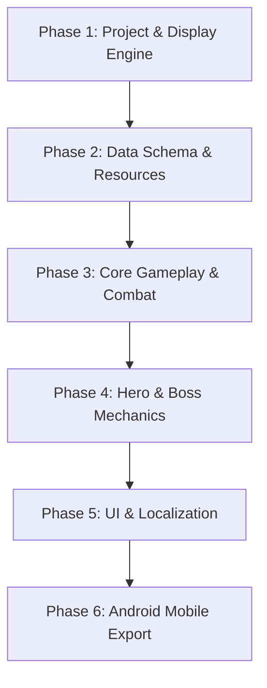

# Godot 4 Migration Plan — Arcane Siege Tower Defense

## 1. Executive Summary & Migration Rationale

This document outlines the end-to-end technical strategy for migrating **Kingdom Defenders: Arcane Siege** from **Phaser 3.80 + TypeScript + Capacitor** to **Godot Engine 4.3+ (2D)**.

### Rationale for Migration
- **Dedicated 2D Node-Tree Architecture**: Godot 4's scene composition paradigm (`Node2D`, `Area2D`, `PathFollow2D`) inherently solves complex 2D mobile tower defense architecture challenges.
- **Native Mobile Export & Hardware Acceleration**: Eliminates WebGL/WebView overhead; compiles to native C++ bytecode on Android/iOS via Vulkan / Forward+ / Compatibility renderer.
- **Visual Scene & Particle Editor**: Built-in animation player, particle shader graph, tilemaps, and UI layout controls replace hand-coded coordinates.
- **Built-in Systems**: Replaces custom implementations with native engine primitives (Signals replace `BoundBus`, `AudioStreamPlayer` replaces Web Audio API, `TranslationServer` replaces `locales.ts`).

---

## 2. Architectural Mapping Matrix

| Current Stack (Phaser 3 / TS) | Target Godot 4 Equivalent | Architectural Role |
| :--- | :--- | :--- |
| **`Phaser.Scene`** (Boot, Menu, LevelSelect, GameScene, UIScene) | **`Node2D` / `Control` Scenes** (`.tscn`) | Root container for game stages and UI overlays. |
| **`Hero.ts`** | **`CharacterBody2D`** + `AnimationPlayer` | Movable hero entity with velocity, navigation, and skills. |
| **`Enemy.ts`** | **`PathFollow2D`** wrapping **`Area2D`** | Path-constrained monster movement with collision detection. |
| **`Tower.ts`** | **`Node2D`** with **`Area2D`** (Range Circle) | Static defense node with target acquisition & fire loop. |
| **`Projectile.ts`** | **`Node2D`** or **`Area2D`** | Homed or ballistic missile entity (reused via Node Instancing). |
| **`BoundBus.ts`** | **Godot Signals** (`signal wave_started`) | Decoupled event emission and observation. |
| **`AudioManager.ts`** | **`AudioStreamPlayer`** with Audio Buses | Sound FX & music volume bus routing. |
| **`SaveManager.ts`** | **`ConfigFile`** or custom `Resource` | Persistent player data saved to `user://savegame.cfg`. |
| **`locales.ts`** | **`TranslationServer`** (`.csv` / `.po`) | Engine-level localization for text nodes. |

---

## 3. Phased Migration Roadmap



### Phase 1: Project Setup & Display Engine Configuration
1. **Engine Selection**: Install Godot 4.3+ (Standard edition with GDScript or .NET C# edition).
2. **Display Settings**:
   - Resolution: `1280 x 720` (Landscape).
   - Stretch Mode: `canvas_items` (Aspect: `keep` or `expand`).
3. **Renderer Choice**: `Compatibility` (OpenGL ES 3.0) — optimized for maximum mobile device compatibility.
4. **Audio Bus Layout**:
   - Master -> Music
   - Master -> SFX
5. **Input Map**:
   - Action bindings for `touch_click`, `hero_skill_1`, `pause_toggle`, `cancel_action`.

### Phase 2: Data & Asset Migration
1. **Asset Porting**:
   - Copy texture atlases and PNG sprites from `public/assets/` into `res://assets/sprites/`.
   - Import audio samples (`.wav`/`.ogg`) into `res://assets/audio/`.
2. **Resource Data Classes (`.gd` / `.tres`)**:
   - **`TowerData.gd`**: Scriptable `Resource` defining damage, range, attack speed, cost, and branch paths.
   - **`EnemyData.gd`**: Scriptable `Resource` defining HP, speed, armor, magic resistance, and gold yield.
   - **`LevelData.gd`**: Scriptable `Resource` defining paths, initial gold, lives, wave groups, and obstacle slots.
3. **Level Importer Adapter**:
   - Create a Godot Editor plugin script to read existing JSON level definitions from `src/config/levelsConfig.ts` into Godot `.tres` resource files.

### Phase 3: Core Tower Defense Gameplay Engine
1. **Level Map & Pathing System**:
   - Use **`TileMapLayer`** or **`Path2D`** nodes for road definitions.
   - Enemies attach to **`PathFollow2D`** for seamless smooth movement along curves.
2. **Tower Range & Targeting System**:
   - **`Area2D`** with **`CollisionShape2D`** (CircleShape2D) for detection.
   - Connect `area_entered` and `area_exited` signals to maintain an active enemy array.
   - Implement targeting priority logic (`FIRST`, `LAST`, `STRONG`, `WEAK`).
3. **Combat & Projectile Subsystem**:
   - Bullet instancing via `preload("res://scenes/projectiles/Arrow.tscn").instantiate()`.
   - Node recycling using custom pool or `queue_free()` node lifecycle.

### Phase 4: Hero Systems & Boss Encounter Mechanics
1. **Hero Controller**:
   - **`CharacterBody2D`** moving with `velocity = position.direction_to(target) * speed`.
   - Navigation via **`NavigationAgent2D`** for smart terrain pathfinding around obstacles.
2. **Boss Phase State Machine**:
   - Implement **State Machine** pattern (`Phase1`, `Phase2`, `Phase3`).
   - Phase transition signals emit visual telegraphs (Camera shake, shockwave particles, screen flash).
   - Custom shockwave shaders using Godot **`ColorRect` + CanvasItem Shader**.

### Phase 5: UI, HUD & Localization Integration
1. **HUD Control Nodes**:
   - **`Control`** root with `MarginContainer`, `HBoxContainer`, `VBoxContainer`.
   - Gold, Lives, Wave Counter, Speed Selector (`1x`, `2x`, `4x` time scale via `Engine.time_scale`).
2. **Radial Menus & Inspector Panels**:
   - Radial tower build/upgrade menu using Godot Control node rotation layout.
   - Bestiary and Relic modals built as overlay CanvasLayer nodes.
3. **Localization Server**:
   - Export `src/i18n/locales.ts` strings into `translations.csv`.
   - Register CSV in `Project Settings -> Localization -> Translations`.
   - Use `tr("KEY_NAME")` in script or assign keys directly in Label nodes.

### Phase 6: Android Export, Signing & Mobile QA
1. **Android Export Setup**:
   - Download Android SDK & Build Tools in Godot.
   - Configure Debug and Release Keystores in `Project -> Export -> Android`.
2. **Feature Optimization**:
   - Enable GLES3 fallback and multithreaded rendering.
   - Configure touch input emulation (`Emulate Touch From Mouse`).
3. **APK / AAB Production Build**:
   - Export signed `.aab` bundle for Google Play Store submission.

---

## 4. Code Parity Reference Example

### TypeScript (Phaser 3) vs. GDScript (Godot 4)

#### Phaser 3 Target Acquisition (`Tower.ts`)
```typescript
findTarget(enemies: Enemy[], priority: TargetPriority): Enemy | null {
  const inRange = enemies.filter(e => e.isAlive && Phaser.Math.Distance.Between(this.x, this.y, e.x, e.y) <= this.range);
  if (inRange.length === 0) return null;
  if (priority === TargetPriority.STRONG) {
    return inRange.reduce((max, e) => e.hp > max.hp ? e : max, inRange[0]);
  }
  return inRange[0];
}
```

#### Godot 4 Equivalent (`Tower.gd`)
```gdscript
extends Node2D
class_name Tower

@export var tower_data: TowerData
@onready var range_area: Area2D = $RangeArea

var enemies_in_range: Array[Enemy] = []

func _on_range_area_body_entered(body: Node2D) -> void:
    if body is Enemy and body.is_alive:
        enemies_in_range.append(body)

func _on_range_area_body_exited(body: Node2D) -> void:
    if body is Enemy:
        enemies_in_range.erase(body)

func get_target(priority: String) -> Enemy:
    var valid = enemies_in_range.filter(func(e): return is_instance_valid(e) and e.is_alive)
    if valid.is_empty():
        return null
    if priority == "STRONG":
        valid.sort_custom(func(a, b): return a.hp > b.hp)
    return valid[0]
```

---

## 5. Migration Timeline & Risk Assessment

| Phase | Estimated Effort | Risk Level | Mitigation Strategy |
| :--- | :--- | :--- | :--- |
| **Phase 1: Project Setup** | 2-3 Days | Low | Use standard Compatibility renderer for Android. |
| **Phase 2: Data Resources** | 3-5 Days | Low | Write automated adapter script to convert TS config JSON. |
| **Phase 3: Core Gameplay** | 1-2 Weeks | Medium | Leverage Godot `Path2D` and `Area2D` primitives. |
| **Phase 4: Hero & Bosses** | 1 Week | Medium | Recreate state machines using Godot Node states. |
| **Phase 5: UI & i18n** | 1 Week | Low | Use Godot Control layout anchors and `TranslationServer`. |
| **Phase 6: Android Export** | 3-4 Days | Low | Setup export presets early in Phase 1. |

**Total Estimated Duration**: **4 - 5 Weeks**
